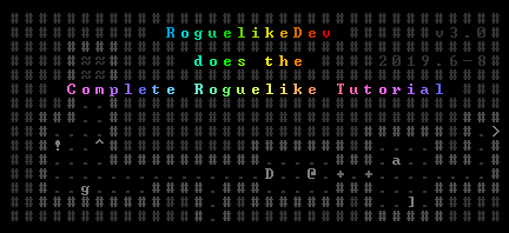

# Roguelike Game (*roguelike*)
> *My journey into creating a roguelike game based off TCOD Roguelike Tutorial*

![Python version][python-version]
![Latest version][latest-version]
[![GitHub issues][issues-image]][issues-url]
[![GitHub forks][fork-image]][fork-url]
[![GitHub Stars][stars-image]][stars-url]
[![License][license-image]][license-url]

NOTE: This app was generated with [Cookiecutter](https://github.com/audreyr/cookiecutter) along with [@clamytoe's](https://github.com/clamytoe) [toepack](https://github.com/clamytoe/toepack) project template.



This repo will be used to track my progress as I code the Roguelike Game at: [rogueliketutorials.com](http://rogueliketutorials.com/tutorials/tcod/)

### Initial setup
```zsh
cd Projects
git clone https://github.com/clamytoe/roguelike.git
cd roguelike
```

#### Anaconda setup
If you are an Anaconda user, this command will get you up to speed with the base installation.
```zsh
conda env create
conda activate roguelike
```

#### Regular Python setup
If you are just using normal Python, this will get you ready, but I highly recommend that you do this in a virtual environment. There are many ways to do this, the simplest using *venv*.
```zsh
python3 -m venv venv
source venv/bin/activate
pip install -r requirements.txt
```

#### Final setup
```zsh
pip install -e .
```

## Usage
```zsh
roguelike
```

## Contributing
Contributions are very welcome. Tests can be run with with `pytest -v`, please ensure that all tests are passing and that you've checked your code with the following packages before submitting a pull request:
* black
* isort
* mypy
* pytest-cov

I am not adhering to them strictly, but try to clean up what's reasonable.

## License
Distributed under the terms of the [MIT](https://opensource.org/licenses/MIT) license, "roguelike" is free and open source software.

## Issues
If you encounter any problems, please [file an issue](https://github.com/clamytoe/toepack/issues) along with a detailed description.

## Changelog
* **v0.1.10** Part 10 - Saving and loading
* **v0.1.9** Part 9 - Ranged Scrolls and Targeting
* **v0.1.8** Part 8 - Items and Inventory
* **v0.1.7** Part 7 - Creating the Interface
* **v0.1.6** Part 6 - Doing (and taking) some damage
* **v0.1.5** Part 5 - Placing enemies and kicking them (harmlessly) 
* **v0.1.4** Part 4 - Field of view
* **v0.1.3** Part 3 - Generating a dungeon
* **v0.1.2** Part 2 - The generic Entity, the render functions, and the map
* **v0.1.1** Part 1 - Drawing the ‘@’ symbol and moving it around
* **v0.1.0** Part 0 - Setting up.

[python-version]:https://img.shields.io/badge/python-3.7.3-brightgreen.svg
[latest-version]:https://img.shields.io/badge/version-0.1.0-blue.svg
[issues-image]:https://img.shields.io/github/issues/clamytoe/roguelike.svg
[issues-url]:https://github.com/clamytoe/roguelike/issues
[fork-image]:https://img.shields.io/github/forks/clamytoe/roguelike.svg
[fork-url]:https://github.com/clamytoe/roguelike/network
[stars-image]:https://img.shields.io/github/stars/clamytoe/roguelike.svg
[stars-url]:https://github.com/clamytoe/roguelike/stargazers
[license-image]:https://img.shields.io/github/license/clamytoe/roguelike.svg
[license-url]:https://github.com/clamytoe/roguelike/blob/master/LICENSE
